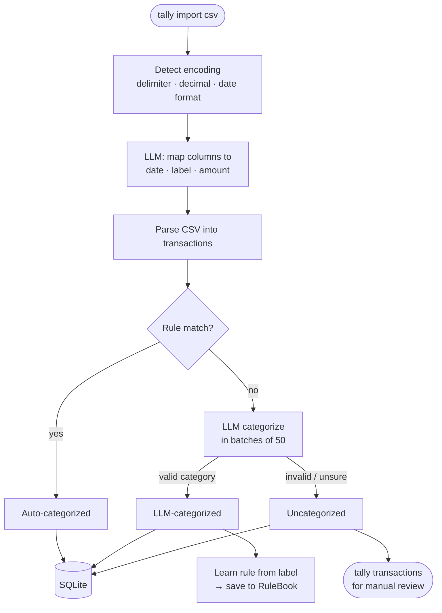
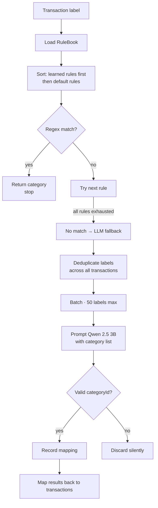
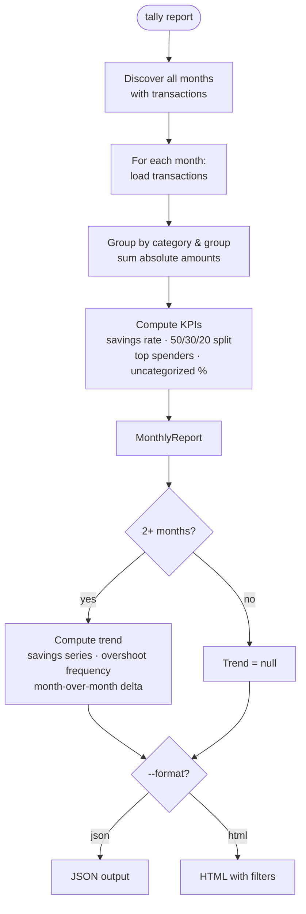
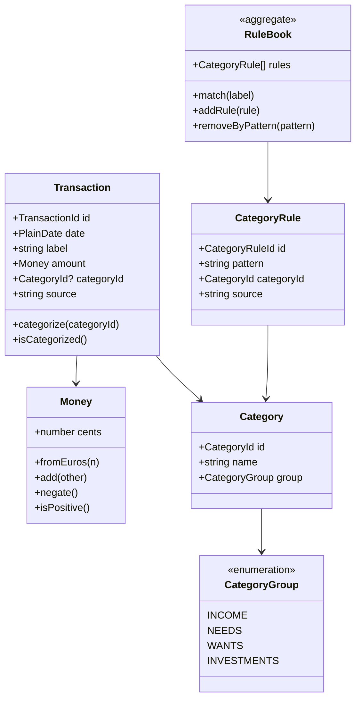

# Contributing

## Setup

```bash
npm install
npm run fmt          # Format
npm run lint         # Lint
npm run test         # Run tests
npm run test:watch   # Watch mode
npm run test:coverage
```

Install pre-commit hooks (format, lint, build, test run on every commit):

```bash
pip install pre-commit
pre-commit install
```

---

## Architecture

tally follows **Clean Architecture** (hexagonal / ports & adapters). The rule is simple: dependencies only point inward.

```
┌─────────────────────────────────────────┐
│              Presentation               │  CLI commands, renderers
│  ┌───────────────────────────────────┐  │
│  │           Application             │  │  Use cases, gateways (interfaces)
│  │  ┌─────────────────────────────┐  │  │
│  │  │          Domain             │  │  │  Entities, value objects, logic
│  │  └─────────────────────────────┘  │  │
│  └───────────────────────────────────┘  │
│         Infrastructure                  │  SQLite, LLM, CSV parsing
└─────────────────────────────────────────┘
```

### Layer responsibilities

| Layer              | Owns                                               | Never touches      |
| ------------------ | -------------------------------------------------- | ------------------ |
| **Domain**         | Entities, value objects, aggregates, domain errors | I/O, frameworks    |
| **Application**    | Use cases (commands + queries), gateway interfaces | Concrete adapters  |
| **Infrastructure** | SQLite repos, LLM adapter, CSV parsers             | Domain-layer logic |
| **Presentation**   | CLI commands, composition root                     | Business rules     |

The application layer defines **gateway interfaces** (ports). Infrastructure provides the concrete implementations (adapters). The domain knows nothing about either.

---

## Key Flows

### CSV Import



**Key points:**

- Format detection is automatic — no config file, no manual column mapping
- Rules run before the LLM; known merchants are categorized for free
- Only LLM-categorized transactions generate new learned rules (not regex-matched ones)
- Learned rules take precedence over default rules on the next import
- All writes are atomic (single DB transaction)

---

### Categorization pipeline



**Rule learning:** After LLM categorization, `extractPattern()` strips bank noise (card prefixes, dates, IDs) and generates a 1–2 word regex from the merchant name. That regex becomes the new rule.

---

### Report generation



Spending targets (50/30/20 split) are configurable via `--needs`, `--wants`, `--invest` flags. Budget vs. actual is computed against those targets.

---

## Domain Model



**Stable category IDs** (`n01`–`n17`, `w01`–`w08`, `i01`–`i04`, `inc01`–`inc04`) are stored in the database and must never be renamed or reused. 31 categories across 4 groups: NEEDS, WANTS, INVESTMENTS, INCOME.

---

## Testing

### Strategy

Three test layers:

- **Unit** — use cases and domain logic in isolation, with in-memory adapters
- **Integration** — full workflows end-to-end (import → DB → report), still in-memory
- **Architecture** — enforce layer dependency rules and naming conventions

No test ever touches the real LLM or a real SQLite file.

### Mocking pattern

Gateway interfaces have in-memory test implementations — not `vi.mock()` calls. This keeps tests refactor-safe:

```typescript
// In-memory repo — implements the same interface as the real SQLite adapter
const repo = new InMemoryTransactionRepository();
repo.seed([...transactions]);

// Mock LLM categorizer — typed, no magic strings
const categorizer: TransactionCategorizer = {
  categorize: vi.fn().mockResolvedValue({ invalidCount: 0, results: [] }),
};

// Mock UnitOfWork — transparent pass-through
const unitOfWork: UnitOfWork = { runInTransaction: (fn) => fn() };
```

Tests assert on what was saved to the in-memory repo and what callbacks were invoked — not on implementation details.

### Architecture enforcement

A dedicated test suite verifies:

- Domain has no imports from application, infrastructure, or presentation
- Application has no imports from infrastructure or presentation
- Infrastructure does not import from presentation
- All gateway implementations live in infrastructure
- All use cases live in application

This is checked automatically on every `npm run test` run.

---

## Adding features

### New use case

1. Define the interface in the application layer (if a new gateway is needed)
2. Implement the use case — depends only on domain types and gateway interfaces
3. Write a test using in-memory adapters
4. Wire it in the composition root (presentation layer), where concrete implementations are injected
5. Add the CLI command in the presentation layer

### New infrastructure adapter

1. Find the gateway interface in the application layer
2. Implement it in the infrastructure layer
3. Swap it in the composition root — no other code changes needed

### New category

Categories are part of the domain configuration. Adding one means assigning it a permanent ID (following the existing `n__`, `w__`, `i__`, `inc__` scheme), a group, and a default locale name. The ID is stored in the database — it must be chosen carefully and never changed afterward.

---

## Spec-driven development

Non-trivial features go through an [OpenSpec](https://github.com/snutij/openspec) workflow before implementation:

```
propose → design → tasks → implement → verify → archive
```

Specs live under `openspec/` and use BDD-style scenarios (WHEN / THEN). Completed changes are archived; active changes sit in `openspec/changes/`. Specs describe behavior, not implementation — they stay valid as the code evolves.
